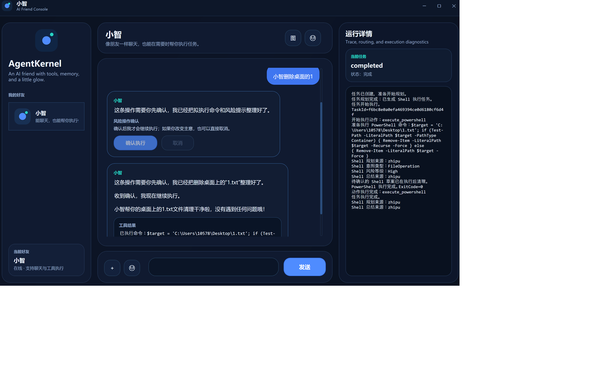

# AgentKernel

一个面向 Windows 的 AI 超级终端原型，支持自然语言聊天与受控的 PowerShell 工具执行。
本项目目前处于早期迭代阶段，重点在“可用的执行闭环”和“安全确认”。

## 功能特性
- 自然语言聊天（支持智谱或本地兜底）
- PowerShell 工具执行（含高风险操作确认）
- 任务执行日志与结果回显

## 项目亮点
- 端到端“自然语言 → 任务规划 → 工具执行 → 结果回显”的可用闭环
- 高风险操作确认机制，降低误执行风险
- 能力模块化设计，便于扩展新能力与执行策略
- 提供架构文档，规划后续多模态 / 记忆 / 多 Agent 扩展方向（见 `ARCHITECTURE.md`）
- 面向桌面端 Agent 的可扩展框架，支持本地模型与云端 API 接入，便于对接现有 .NET / WPF / Web 端（当前以 WPF 为主）

## 运行环境
- Windows 10/11
- .NET 8 SDK

## 快速开始
1. 打开解决方案 `AgentKernel.sln`
2. 运行 WPF 项目 `AgentKernel.Host.Wpf`
3. 发送自然语言指令，例如：
   - “查看桌面文件”
   - “打开记事本”
   - “删除桌面上的1.txt”（需要确认）

## 配置（API Key）
本项目使用本地配置文件，避免将密钥提交到仓库。

- **本地配置文件：**  
  `src/AgentKernel.Host.Wpf/appsettings.local.json`

- **示例配置：**  
  参考 `src/AgentKernel.Host.Wpf/appsettings.example.json`，复制并改名为 `appsettings.local.json`。

## 安全说明
高风险操作会进入确认流程，避免误执行。

## 免责声明
本项目仍处于迭代阶段，请勿在生产环境直接使用。
